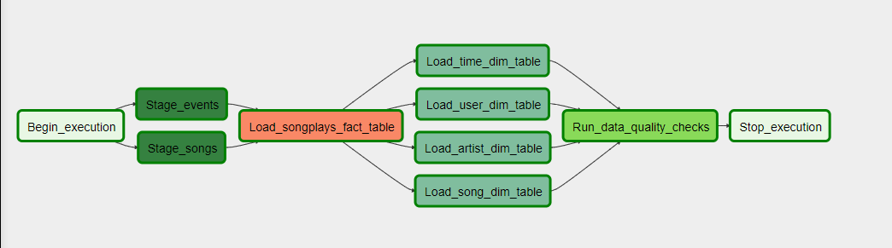

# Data Engineering Nanodegree
## Project: Airflow with AWS

Jesse Fredrickson

2/12/20

## Purpose
The purpose of this project is to use Airflow to manage a DAG (Directional Acyclic Graph) which governs an ETL (Extract, Transform, Load) pipeline to transport data from an Amazon S3 bucket (owned by Udacity) into staging, fact, and dimension tables stored on Amazon Redshift (owned by me).

## Method
The S3 bucket, owned by Udacity, contains all of the source json files that are to be processed. I set up a Redshift cluster to handle SQL data. Udacity stands up an instance of Airflow on their student workspace, and I create a DAG with custom operators and connections to handle the data. Data is pulled out of songs and events json files, and staged in a pair of tables in Redshift. It is then loaded into one fact and 4 dimension tables. Finally, a quality check is performed to ensure that no tables are invalid or empty. See DAG below.

## Files
- **etl<i></i>.py:** Contains main logic for ETL pipeline to populate SQL tables from json files, and save them back to S3. Udacity S3 bucket info is hardcoded.
- **create_conns.py:** (TEMPLATE ONLY) contains code to automatically generate Airflow connections to S3 and Redshift.
- **airflow/create_tables.sql:** contains SQL to automatically generate Redshift create tables
- **airflow/dags/udac_example_dag.py:** contains high level DAG architecture and order of operations
- **airflow/plugins/helpers/sql_queries.py:** contains all SQL insert statements
- **airflow/plugins/operators/*.py:** contains all custom operators

## Usage
1. Create an AWS Redshift cluster with a RedShift IAM role attached
2. Once it has been created, configure it to be publicly accessible and copy the endpoint (minus port) into the create_conns.py file. (both items in **AWS->cluster->properties**)
3. Configure the rest of rest of the template fields in create_conns.py to match your connections.
4. Connect to your redshift cluster via AWS' Redshift editor, and execute the commands from create_tables.sql to generate all redshift tables.
5. Start Airflow (Udacity env command is `/opt/airflow/start.sh`) and run `create_conns.py`
6. *optional:* execute the dag python file from the command line to ensure that no compile error occur prior to executing in Airflow
7. Start the Airflow UI (Udacity provided a button for this)
8. Run the dag in Airflow by toggling the dag to 'on' in the airflow UI
9. *useful:* if for any reason you need to shut down Airflow to restart it, run `pkill -f airflow` to kill all airflow processes
